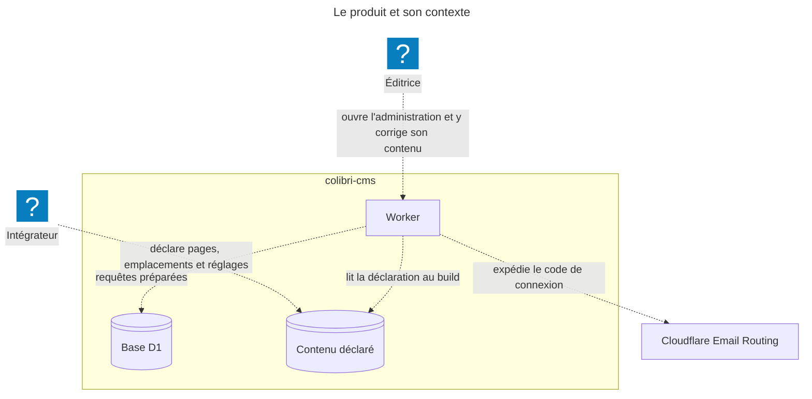
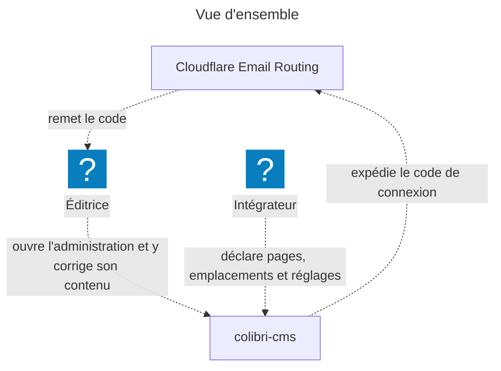
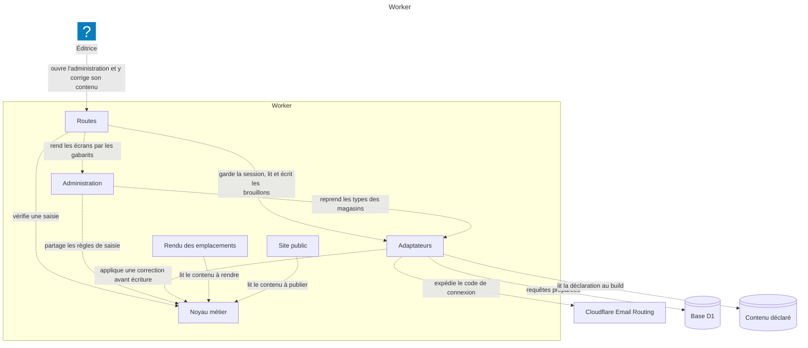
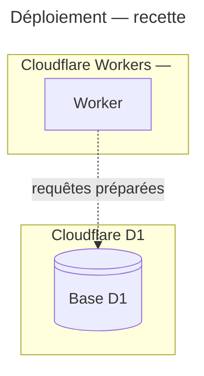
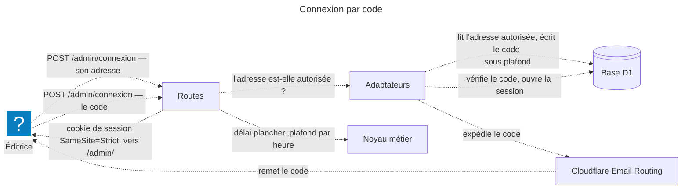
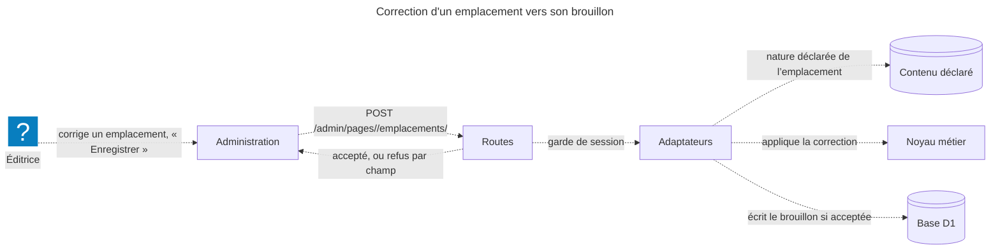
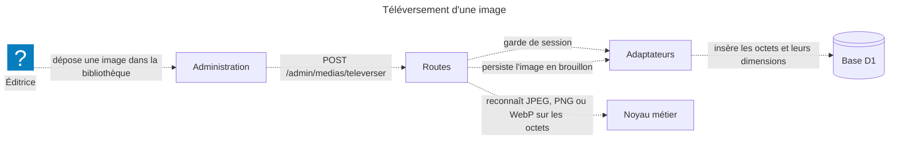
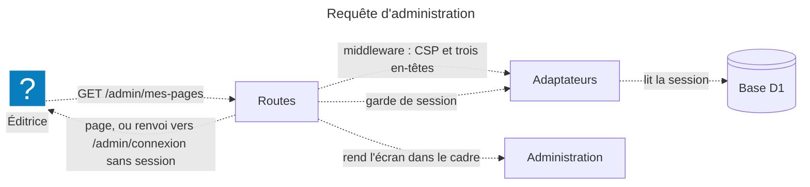

# Architecture — ColibriCMS

Le dossier d'architecture **relevé depuis le code** le 2026-10-09 : ce que le produit est aujourd'hui, pas
ce qu'il sera. Le modèle fait foi (`*.c4`) ; ce fichier s'en déduit. Les invariants opposables sont dans
[`../architecture.md`](../architecture.md), le *pourquoi* des choix dans [`../adr/`](../adr/).

<!-- scd:contexte -->
## Le produit et son contexte

- **Éditrice** — la cliente, seule utilisatrice de l'administration, sans notion technique ; elle entre par
  un code reçu par e-mail.
- **Intégrateur** — Isometria : pose les gabarits, les emplacements et les réglages de départ dans
  `content/`, hors administration.
- **Cloudflare Email Routing** *(externe)* — achemine l'e-mail portant le code de connexion vers l'adresse
  autorisée.

Pas encore dans le modèle, faute de trace dans le code : le **visiteur** (aucune route publique), **GitHub**
(publication) et **Turnstile** (anti-abus) — ils y entreront avec les stories qui les écrivent.

<!-- /scd:contexte -->

<!-- scd:conteneurs -->
## Les conteneurs

Un **monolithe modulaire** : une seule unité déployée, dont les frontières internes sont les zones de
`src/` (matrice `I1`).

| Élément | Technologie | Code | Ce qu'il fait |
|---|---|---|---|
| `colibri-cms.worker` | Astro 7 (sortie serveur) sur Cloudflare Workers | `src` | L'unique unité déployée : sert l'administration, et servira le site public sur la même origine. |
| `colibri-cms.worker.routes` | Astro | `src/pages` | Un fichier = une URL ; chaque route est mince, garde la session et délègue. |
| `colibri-cms.worker.admin` | Astro + îlots Svelte 5, shadcn-svelte | `src/admin` | Écrans, gabarits et îlots de l'administration. |
| `colibri-cms.worker.core` | TypeScript pur | `src/core` | La logique métier, sans framework ni plateforme. |
| `colibri-cms.worker.platform` | TypeScript + liaisons Cloudflare | `src/platform` | Session, magasins D1, envoi d'e-mail, lecture du contenu déclaré, en-têtes de sécurité. |
| `colibri-cms.worker.render` | Astro | `src/render` | Rendu des emplacements partagé par le publié et l'aperçu — zone posée, encore vide. |
| `colibri-cms.worker.site` | Astro | `src/site` | Gabarits du site publié — zone posée, encore vide. |
| `colibri-cms.d1` | Cloudflare D1 (SQLite) | `migrations` | Adresse autorisée, codes, sessions, brouillons des pages, des médias et des réglages. |
| `colibri-cms.contenu` | JSON et Markdown versionnés | `content` | La déclaration de l'intégrateur ; lue au build, jamais écrite par le produit. |

### L'intérieur du Worker

<!-- /scd:conteneurs -->

<!-- scd:deploiement -->
## Le déploiement

Aucune production n'est encore déployée (Epic D de la feuille de route). Deux lieux ont une trace :

- **Poste local** — `astro dev` et la suite de tests tournent dans Miniflare (`workerd`), liaisons D1 et
  envoi d'e-mail servies localement.
- **Recette** — Cloudflare Workers sur `colibri.sebc.dev`, avec une vraie base D1.

<!-- /scd:deploiement -->

<!-- scd:flux -->
## Les flux clés

### Connexion par code

### Correction d'un emplacement vers son brouillon

### Téléversement d'une image

### Requête d'administration

<!-- /scd:flux -->

<!-- scd:decisions -->
## Décisions à figer — `/scd-spec-dev:adr`

Ce que le code a déjà tranché et qu'aucun ADR accepté ne porte encore ; chacune existe en candidat sous
`docs/adr/_candidates/`.

| Décision observée | Trace | ADR |
|---|---|---|
| Sens unique et descendant des dépendances entre zones (`I1`) | `eslint.config.boundaries.js:46-52` | — |
| `src/core/` sans framework ni plateforme (`I2`) | `eslint.config.boundaries.js:29` | — |
| Astro 7 génère l'administration et le futur site | `package.json:40`, `astro.config.ts:68` | — |
| Svelte 5 pour les îlots | `package.json:43`, `astro.config.ts:115` | — |
| TypeScript strict, plafonné à la branche 6 | `tsconfig.json:2-4`, `package.json:65` | — |
| npm, avec gel d'approvisionnement de sept jours | `package-lock.json`, `.npmrc` | — |
| API D1 native et migrations `wrangler d1` | `wrangler.astro.jsonc:6-11`, `package.json:28` | — |
| Un Worker unique sert public et administration | `wrangler.astro.jsonc:3`, `astro.config.ts:98` | — |
| D1 porte les brouillons | `migrations/0004…0007` | — |
| Contenu déposé : un répertoire par objet | `content/pages/*/page.json` | — |
| Médias reconnus sur leurs octets, liste blanche JPEG/PNG/WebP | `src/core/medias/ingestion.ts:13,72` | — |
| Texte riche en Markdown restreint, schémas d'URL autorisés | `src/core/pages/texte-riche.ts:69,153` | — |
| Valeurs d'instance dans `instance.json`, lues par la configuration Astro (`I8`, `I10`) | `instance.json`, `astro.config.ts:51-57` | — |
<!-- /scd:decisions -->

Le modèle est dans `*.c4` ; ce fichier s'en déduit. Valider :
`likec4 validate --no-layout --json --project colibri-cms docs/architecture` — rendre les vues :
`likec4 gen mermaid -o <répertoire hors du dépôt> docs/architecture`.
