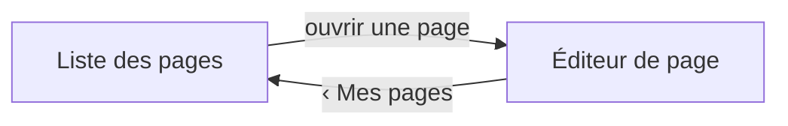

# UX — Remplir et corriger les emplacements d'une page

L'éditrice retrouve ses pages, en ouvre une, et corrige le contenu de chaque emplacement posé par
l'intégrateur — sans jamais pouvoir toucher à la structure de la page. Aucun terme de développeur ne
paraît (FR-117).

## Canvas
<!-- Pas de canvas Claude Design pour ce change ; les écrans sont décrits en ASCII ci-dessous
     (source : specs/003-remplir-emplacements/maquette.md). -->
> (aucun — écrans décrits ci-dessous)

## Écrans & états

### Écran : Cadre de l'administration
Le cadre commun à tous les écrans d'édition : une barre latérale rétractable qui porte le menu ; les
écrans s'affichent dans sa zone de contenu.

```
┌────────────┬──────────────────────────────┐
│ La pâtisser…│                              │
│ [«]        │                               │
│ ▸ Mes pages│  ← rubrique active            │
│   Médias   │       zone de contenu         │
│   Réglages │                               │
│   Formulaires                              │
│   Demandes │                               │
└────────────┴──────────────────────────────┘
```

- **Zones :** barre latérale (menu entre rubriques, « Mes pages » active) · bouton de repli (réduit la
  barre à un rail d'icônes et la redéploie, la zone de contenu s'élargit d'autant) · zone de contenu
  (accueille l'écran courant).
- **États :** *dépliée* — libellés à côté des icônes (défaut) · *repliée* — rail d'icônes seules, la
  rubrique active reste marquée.
- **Portée :** seule « Mes pages » est servie ; Médias, Réglages, Formulaires, Demandes situent la
  navigation des features à venir.

### Écran : Liste des pages
Le point d'entrée de l'édition : toutes les pages du site, chacune signalant si elle porte un brouillon.

```
┌───────────────────────────────────────────────┐
│ Mes pages                                       │
├───────────────────────────────────────────────┤
│  Accueil                          • brouillon   │
│  Tarifs                                         │
│  Contact                          • brouillon   │
└───────────────────────────────────────────────┘
```

- **Zones :** liste des pages (une ligne par page, ouvre l'éditeur au clic) · pastille de brouillon
  (présente sur une page porteuse de corrections non publiées, absente sinon).
- **États :** *vide* — aucune page déclarée : un message dit qu'il n'y a rien à éditer, sans aucun geste
  de création (FR-024).

### Écran : Éditeur de page
Une page ouverte : ses emplacements dans l'ordre posé, chacun avec le moyen d'édition de sa nature. Aucun
geste n'ajoute, ne retire, ne déplace ni ne renomme un emplacement.

```
┌───────────────────────────────────────────────┐
│ ‹ Mes pages          Accueil       • brouillon  │
├───────────────────────────────────────────────┤
│ ┌───────────────────────────────────────────┐ │
│ │ [B I  lien  • liste  H]                    │ │  ← emplacement : texte riche
│ │ Bienvenue à la pâtisserie…                 │ │
│ └───────────────────────────────────────────┘ │
│ ┌───────────────────────────────────────────┐ │
│ │ Lien de la vidéo : [___________________]   │ │  ← emplacement : lien de vidéo
│ └───────────────────────────────────────────┘ │
│ ┌───────────────────────────────────────────┐ │
│ │ Libellé : [__________]  Va vers : [______] │ │  ← emplacement : bouton d'action
│ └───────────────────────────────────────────┘ │
└───────────────────────────────────────────────┘
```

- **Zones :** fil de retour + titre de la page + pastille de brouillon (la pastille apparaît dès la
  première correction) · emplacement de texte riche (barre de mise en forme gras/italique/lien/liste/titre
  + corps ; la mise en forme se pose sans écrire de balise) · emplacement de lien de vidéo (un seul champ :
  le lien externe) · emplacement de bouton d'action (deux champs : libellé, destination).
- **États :** *erreur (lien de vidéo)* — un lien non reconnu est refusé au niveau du champ, en disant ce
  qui est attendu · *après correction* — la pastille de brouillon passe à « présent » sans quitter
  l'écran ; le site public reste inchangé.

### Flux



## Critères d'acceptation UX
- UX1 — Le cadre présente les cinq rubriques, « Mes pages » active ; aucun terme de développeur n'y paraît.
- UX2 — Le repli/déploiement de la barre est immédiat et l'état est retenu sur l'appareil au rechargement,
  sans requête serveur.
- UX3 — Aucun geste visible n'ajoute, ne retire, ne déplace ni ne renomme une page ou un emplacement
  (FR-024/025) — la structure n'est jamais offerte à l'écran.
- UX4 — Une correction fait apparaître la pastille de brouillon sans quitter l'écran, et le site public
  reste inchangé.
- UX5 — Un lien de vidéo non reconnu est refusé au niveau du champ, en disant ce qui est attendu, sans rien
  enregistrer.
- UX6 — La mise en forme du texte riche (gras, italique, lien, liste, titre) se pose sans que l'éditrice
  écrive de balise.
