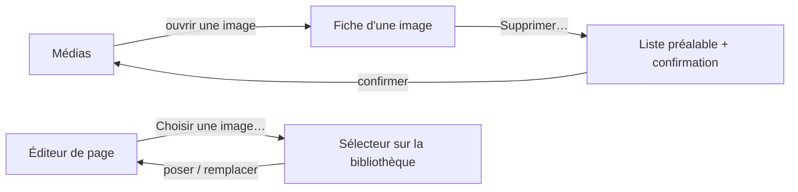

# UX — Bibliothèque de médias

L'éditrice constitue sa réserve d'images : elle téléverse, retrouve, renomme et décrit ses images, voit où
chacune est posée, et supprime sans jamais laisser un emplacement pointer une image absente. Depuis l'éditeur
d'une page, elle pose une image déjà présente dans un emplacement d'image, de galerie ou de carrousel. Aucun
terme de développeur ne paraît (FR-117).

## Canvas
<!-- Pas de canvas Claude Design pour ce change ; les écrans sont décrits en ASCII ci-dessous,
     dans la continuité de la maquette de 003. -->
> (aucun — écrans décrits ci-dessous)

## Écrans & états

### Écran : Médias
La rubrique « Médias » devient active : la grille de toutes les images du site, une barre de recherche, et
le téléversement. Chaque vignette signale l'image orpheline vouée à l'effacement à la prochaine publication.

```
┌────────────┬──────────────────────────────────────────────┐
│ La pâtisser…│  Médias                    [ Téléverser ]     │
│ [«]        │  Rechercher : [_______________]               │
│   Mes pages│  ┌──────┐ ┌──────┐ ┌──────┐ ┌──────┐          │
│ ▸ Médias   │  │ img  │ │ img  │ │ img  │ │ img  │          │
│   Réglages │  │ tarte│ │ vitr…│ │ four │ │ logo⚠│ ← orph.  │
│   Formulai…│  └──────┘ └──────┘ └──────┘ └──────┘          │
│   Demandes │                                                │
└────────────┴──────────────────────────────────────────────┘
```

- **Zones :** barre de recherche (filtre sur nom + description) · bouton de téléversement · grille (une
  vignette par image, ouvre la fiche au clic) · marque d'orphelin (⚠) sur une image que plus aucun
  emplacement ne référence.
- **États :** *vide (bibliothèque)* — aucune image : un message dit qu'il n'y a encore aucune image ·
  *vide (recherche)* — aucune correspondance : un message propre à la recherche, la bibliothèque intacte ·
  *en téléversement* — l'image apparaît une fois acceptée · *refus de téléversement* — un message dit ce qui
  a été refusé (le format, ou le poids), sans terme de développeur (FR-040, FR-117).

### Écran : Fiche d'une image
Une image ouverte : sa prévisualisation, son nom (éditable), sa description (éditable), la liste des
emplacements où elle est posée, et la suppression.

```
┌───────────────────────────────────────────────┐
│ ‹ Médias                                        │
├───────────────────────────────────────────────┤
│  ┌────────────┐   Nom : [ tarte aux pommes   ] │
│  │  aperçu    │   Description :                 │
│  │  de l'image│   [ Tarte fine, pommes du    ]  │
│  └────────────┘   [ verger.                   ] │
│                                                 │
│  Posée dans : Accueil · emplacement « photo »   │
│               Tarifs · emplacement « bandeau »  │
│                                                 │
│                              [ Supprimer… ]      │
└───────────────────────────────────────────────┘
```

- **Zones :** prévisualisation · champ nom d'affichage · champ description · liste des emplacements posant
  l'image (par page et place, sans terme de développeur) · bouton de suppression.
- **États :** *posée nulle part* — la liste indique qu'aucun emplacement ne la pose · *orpheline* — un
  bandeau signale qu'elle sera effacée à la prochaine publication · *suppression (liste préalable)* — avant
  d'appliquer, la liste des emplacements concernés est présentée pour confirmation (FR-035).

### Écran : Suppression d'une image (liste préalable)
Avant tout retrait, la liste des emplacements concernés, puis la confirmation.

```
┌───────────────────────────────────────────────┐
│  Supprimer « tarte aux pommes » ?               │
│  Elle est posée dans :                          │
│    • Accueil — emplacement « photo »            │
│    • Tarifs  — emplacement « bandeau »          │
│  Elle en sera retirée partout (mis en brouillon)│
│               [ Annuler ]   [ Supprimer ]       │
└───────────────────────────────────────────────┘
```

- **États :** *confirmée* — l'image est retirée de tous ses emplacements, chaque page touchée bascule à
  « brouillon », le site public reste inchangé ; l'image devient orpheline dans la grille (FR-036, SC-010).

### Écran : Éditeur de page — emplacements d'image (extension de 003)
Les natures d'image apparaissent dans l'éditeur, avec un sélecteur ouvrant sur la bibliothèque.

```
┌───────────────────────────────────────────────┐
│ ‹ Mes pages          Accueil       • brouillon  │
│ ┌───────────────────────────────────────────┐ │
│ │ Image :  [ aperçu ]  [ Choisir une image… ]│ │ ← emplacement : image
│ └───────────────────────────────────────────┘ │
│ ┌───────────────────────────────────────────┐ │
│ │ Galerie : [img][img][img]  [ Ajouter… ]    │ │ ← emplacement : galerie / carrousel
│ │           (glisser pour ordonner · retirer)│ │
│ └───────────────────────────────────────────┘ │
└───────────────────────────────────────────────┘
```

- **Zones :** emplacement d'image (aperçu de l'image posée + bouton « Choisir une image… » ouvrant le
  sélecteur sur la bibliothèque ; poser ou remplacer sans re-téléverser, FR-033/034) · emplacement de
  galerie/carrousel (ensemble ordonné d'images ; ajouter depuis la bibliothèque, réordonner, retirer).
- **États :** *vide* — aucun geste de structure ; l'emplacement existe, il attend une image · *après pose* —
  la pastille de brouillon apparaît sans quitter l'écran, le site public reste inchangé.

### Flux



## Critères d'acceptation UX
- UX1 — La grille présente toutes les images du site ; la recherche filtre sur nom et description ; aucun
  terme de développeur n'y paraît.
- UX2 — Un téléversement hors format ou hors poids est refusé en disant lequel, sans terme de développeur ni
  trace technique (FR-040/FR-117).
- UX3 — La fiche d'une image montre les emplacements où elle est posée, désignés par page et place.
- UX4 — Supprimer présente d'abord la liste des emplacements concernés ; après confirmation, l'image en est
  retirée partout, chaque page touchée passe à « brouillon », et le site public reste inchangé.
- UX5 — Une image orpheline est signalée dans la grille et sur sa fiche comme vouée à l'effacement à la
  prochaine publication.
- UX6 — Depuis l'éditeur, l'éditrice pose une image déjà présente sans re-téléverser, et remplace l'image
  posée ; la pastille de brouillon apparaît sans quitter l'écran.
- UX7 — Une galerie ou un carrousel se compose de plusieurs images ordonnées, que l'éditrice ajoute,
  réordonne et retire, sans que ce soit offert comme un geste de structure.
