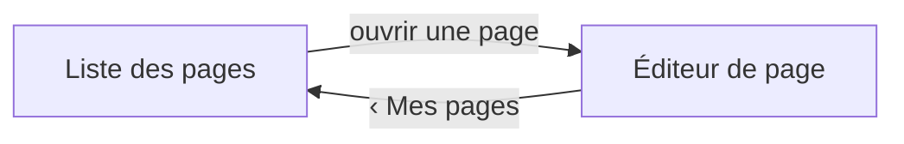

# 003 — Maquette : Remplir et corriger les emplacements d'une page

L'éditrice retrouve ses pages, en ouvre une, et corrige le contenu de chaque emplacement posé par
l'intégrateur — sans jamais pouvoir toucher à la structure de la page.

## Écran : Cadre de l'administration
Le cadre commun à tous les écrans d'édition : une barre latérale rétractable qui porte le menu. Les
écrans ci-dessous s'affichent dans sa zone de contenu.

```
┌────────────┬──────────────────────────────┐
│ La pâtisser…│                              │
│ [«]        │                               │
│ ▸ Mes pages│  ← rubrique active            │
│   Médias   │       zone de contenu         │
│   Réglages │                               │
│   Formulaires                              │
│   Demandes │                               │
└────────────┴──────────────────────────────┘
```

**Zones :**
- barre latérale — le menu de navigation entre les rubriques de l'administration ; « Mes pages » y
  est la rubrique active.
- bouton de repli — réduit la barre à un rail d'icônes et la redéploie ; la zone de contenu s'élargit
  d'autant.
- zone de contenu — accueille l'écran courant (Liste des pages, Éditeur de page).

**États :**
- dépliée — libellés affichés à côté des icônes (état par défaut).
- repliée — un rail d'icônes seules ; la rubrique active reste marquée.

**Portée :** seule « Mes pages » est servie par cette feature ; Médias, Réglages, Formulaires et
Demandes sont les rubriques des features à venir, montrées ici pour situer la navigation. Aucun terme
de développeur n'y paraît (FR-117).

## Écran : Liste des pages
Le point d'entrée de l'édition : toutes les pages du site, chacune signalant si elle porte un brouillon.

```
┌───────────────────────────────────────────────┐
│ Mes pages                                       │
├───────────────────────────────────────────────┤
│  Accueil                          • brouillon   │
│  Tarifs                                         │
│  Contact                          • brouillon   │
└───────────────────────────────────────────────┘
```

**Zones :**
- liste des pages — une ligne par page ; ouvre l'éditeur de la page au clic.
- pastille de brouillon — présente sur une page qui porte des corrections non publiées, absente sinon.

**États :**
- vide — aucune page déclarée pour l'instance : un message dit qu'il n'y a rien à éditer (aucun geste
  de création n'est offert — FR-024).

## Écran : Éditeur de page
Une page ouverte : ses emplacements dans l'ordre posé, chacun avec le moyen d'édition de sa nature.
Aucun geste n'ajoute, ne retire, ne déplace ni ne renomme un emplacement.

```
┌───────────────────────────────────────────────┐
│ ‹ Mes pages          Accueil       • brouillon  │
├───────────────────────────────────────────────┤
│ ┌───────────────────────────────────────────┐ │
│ │ [B I  lien  • liste  H]                    │ │  ← emplacement : texte riche
│ │ Bienvenue à la pâtisserie…                 │ │
│ └───────────────────────────────────────────┘ │
│ ┌───────────────────────────────────────────┐ │
│ │ Lien de la vidéo : [___________________]   │ │  ← emplacement : lien de vidéo
│ └───────────────────────────────────────────┘ │
│ ┌───────────────────────────────────────────┐ │
│ │ Libellé : [__________]  Va vers : [______] │ │  ← emplacement : bouton d'action
│ └───────────────────────────────────────────┘ │
└───────────────────────────────────────────────┘
```

**Zones :**
- fil de retour + titre de la page + pastille de brouillon — situe la page ; la pastille apparaît dès
  la première correction.
- emplacement de texte riche — barre de mise en forme (gras, italique, lien, liste, titre) et corps ;
  la mise en forme se pose sans écrire de balise.
- emplacement de lien de vidéo — un seul champ : le lien externe.
- emplacement de bouton d'action — deux champs : son libellé et sa destination.

**États :**
- erreur (lien de vidéo) — un lien non reconnu est refusé au niveau du champ, en disant ce qui est attendu.
- après correction — la pastille de brouillon passe à « présent » sans quitter l'écran ; le site public
  reste inchangé.

## Flux


